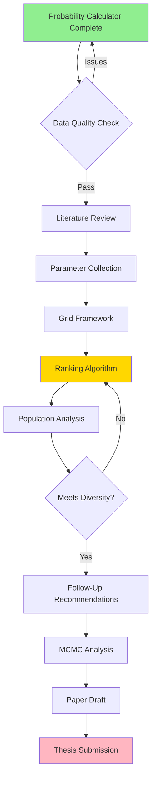
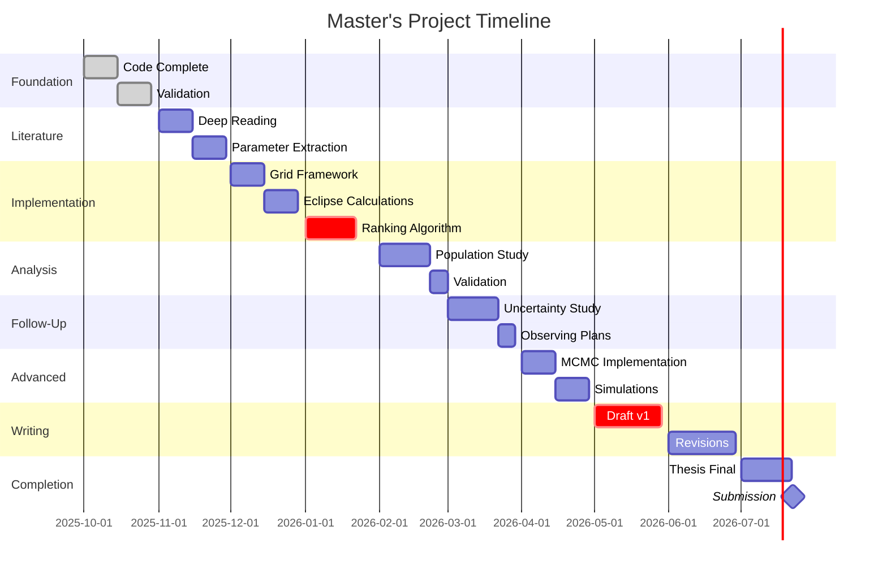
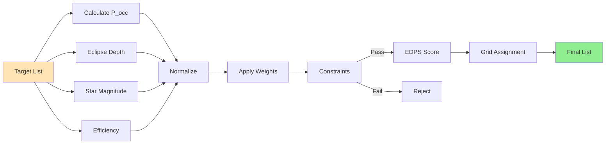
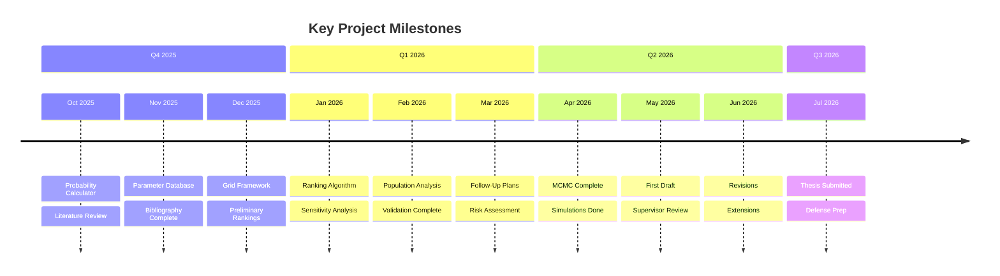

# Master's Project Timeline: Eclipse-Focused Target Selection for Ariel

## Project Overview

**Goal:** Develop an uncertainty-aware, population-diverse target selection framework for Ariel eclipse spectroscopy missions, building on occultation probability calculations and multi-parameter ranking methodology.

**Key Research Question:** How can we optimize Ariel's eclipse spectroscopy target selection to maximize both scientific return and population diversity while accounting for observational uncertainties?

---

## Project Workflow Flowchart



---

## Project Timeline (Gantt Chart)



---

## Ranking Algorithm Flow



---

## Milestone Timeline



---

## Month-by-Month Breakdown

### October 2025 ✅ (CURRENT)

**Focus:** Foundation & Validation

#### Tasks
- [x] Finalize occultation probability calculations
- [x] Validate Monte Carlo implementation
- [x] Document code
- [ ] Begin literature review
- [ ] Set up bibliography system

**Deliverable:** Probability calculator + literature notes

**Check-in:** Present distributions to Billy

---

### November 2025

**Focus:** Literature & Parameter Collection

#### Tasks
- [ ] Deep read: Burt et al. (2025)
- [ ] Extract parameters: Edwards et al. (2019)
- [ ] Study: Valentine et al. (2025) EMM
- [ ] Collect NASA Exoplanet Archive data
- [ ] Calculate eclipse depths

**Deliverable:** Bibliography (15 papers) + parameter database

**Check-in:** Review parameters with Billy

---

### December 2025

**Focus:** Grid Framework

#### Tasks
- [ ] Implement 2D binning (T_eq × R_p)
- [ ] Test bin sizes
- [ ] Visualize MRS distribution
- [ ] Calculate eclipse depths
- [ ] Basic ranking metric

**Deliverable:** Grid visualization + rankings

**Holiday:** Draft introduction

---

### January 2026

**Focus:** Ranking Algorithm

#### Tasks
- [ ] Develop EDPS composite function
- [ ] Implement uncertainty weighting
- [ ] Sensitivity analysis
- [ ] Generate top-50, top-100 lists
- [ ] Compare to Ariel MRS
- [ ] Population coverage metrics

**Deliverable:** Algorithm code + sensitivity analysis

**Check-in:** Present target lists

---

### February 2026

**Focus:** Population Analysis

#### Tasks
- [ ] Create completeness plots
- [ ] Identify under-sampled regions
- [ ] Calculate diversity metrics
- [ ] Validate against known targets
- [ ] Monte Carlo stability tests

**Deliverable:** Population plots + validation report

---

### March 2026

**Focus:** Follow-Up Campaigns

#### Tasks
- [ ] Identify high-uncertainty targets
- [ ] Calculate ephemeris propagation
- [ ] Prioritize RV/transit follow-up
- [ ] Draft observing proposals
- [ ] Risk assessment
- [ ] Resource allocation tree

**Deliverable:** Follow-up list + time estimates

**Check-in:** Discuss feasibility with Billy

---

### April 2026

**Focus:** Advanced Analysis

#### Tasks
- [ ] Implement MCMC for selected targets
- [ ] Use emcee for e-ω posteriors
- [ ] Compare MCMC vs Monte Carlo
- [ ] Simulate observing campaigns
- [ ] Test diversity scenarios
- [ ] What-if analyses

**Deliverable:** MCMC validation + simulations

---

### May 2026

**Focus:** Paper Drafting

#### Tasks
- [ ] Write Methods section
- [ ] Create publication figures
- [ ] Draft Results section
- [ ] Write Discussion
- [ ] Draft Abstract & Introduction
- [ ] Prepare supplementary materials

**Deliverable:** Complete draft v1

**Check-in:** Full draft review with Billy

---

### June 2026

**Focus:** Revisions

#### Tasks
- [ ] Incorporate Billy's feedback
- [ ] Refine figures and tables
- [ ] Polish writing
- [ ] Explore extensions (ML, JWST overlap)

**Deliverable:** Revised draft v2

---

### July 2026

**Focus:** Completion

#### Tasks
- [ ] Expand paper to thesis format
- [ ] Add methodology chapters
- [ ] Code documentation appendix
- [ ] Final review with Billy
- [ ] Format for university
- [ ] Prepare defense

**Deliverable:** Thesis + submitted paper

---

## Ranking Algorithm Details

### Eclipse Detection Priority Score (EDPS)

**Formula:**
```
EDPS = w₁·O_score + w₂·E_score + w₃·Eff_score + w₄·Grid_score
```

**Components:**

1. **O_score** (Occultation Detectability)
   - Formula: `P_occ / σ(P_occ)`
   - High probability + low uncertainty = high score

2. **E_score** (Eclipse Signal)
   - Formula: `Eclipse_Depth × (5 / H_mag)`
   - Strong signal + bright star = high score

3. **Eff_score** (Efficiency)
   - Formula: `(1 / Period) × (1 / Duration)`
   - Short period + quick eclipse = high score

4. **Grid_score** (Diversity)
   - Formula: `1 / N_bin`
   - Empty bins = high priority

**Weights:**
- w₁ = 0.3 (probability)
- w₂ = 0.3 (signal)
- w₃ = 0.2 (efficiency)
- w₄ = 0.2 (diversity)

**Hard Constraints:**
- P_occ > 0.1
- σ(P_occ) / P_occ < 0.5
- H_mag < 12

---

## Risk Assessment

| Risk            | Impact | Mitigation            | Buffer   |
| --------------- | ------ | --------------------- | -------- |
| Incomplete data | High   | Use literature priors | +2 weeks |
| Complex grid    | Medium | Simplify to 1D first  | +1 week  |
| MCMC issues     | Low    | Optional extension    | N/A      |
| Writing delays  | High   | Start early in May    | +2 weeks |

---

## Key Literature

### Core Papers

1. **Winn (2014)** - Occultation equations
2. **Burt et al. (2025)** - Grid methodology
3. **Valentine et al. (2025)** - Eclipse Mapping Metric
4. **Edwards et al. (2019)** - Ariel MRS

### Supporting

5. Shabram et al. (2016) - Eccentricity distributions
6. Stevenson et al. (2025) - RV quality tiers
7. Tinetti et al. (2021) - Ariel mission
8. Southworth (2012) - Transit studies

---

## Weekly Progress Template

```markdown
## Week of [Date]

### Completed
- [ ] Task 1
- [ ] Task 2

### In Progress
- [ ] Task A (50%)

### Blockers
- Issue + solution

### Next Week
1. Goal 1
2. Goal 2

### Questions for Billy
- Question 1
```

---

## Repository Structure

```
ariel-eclipse-selection/
├── data/
│   ├── raw/
│   ├── processed/
│   └── parameters/
├── notebooks/
│   ├── 01_probability.ipynb
│   ├── 02_grid.ipynb
│   ├── 03_ranking.ipynb
│   └── 04_population.ipynb
├── src/
│   ├── occultation.py
│   ├── ranking.py
│   ├── grid_framework.py
│   └── visualization.py
├── figures/
├── docs/
│   ├── literature_notes/
│   ├── meeting_notes/
│   └── PROJECT_TIMELINE.md
├── tests/
└── README.md
```

---

## Success Criteria

By July 2026:

1. ✅ Validated probability catalog (1000+ targets)
2. ✅ Multi-parameter ranking algorithm
3. ✅ Optimized target list (50-100 priorities)
4. ✅ Population diversity analysis
5. ✅ Follow-up recommendations
6. ✅ Publication-ready manuscript
7. ✅ Complete Master's thesis
8. ✅ Public code repository

---

## Contact

**Student:** Zoutong Shen  
**Supervisor:** Billy Edwards (SRON)  
**Duration:** October 2025 - July 2026  
**Check-ins:** Bi-weekly

---

**Version:** 1.0  
**Updated:** October 27, 2025  
**Status:** Foundation Phase